# Ghostty 画室 · Ghostty Atelier

中文 · [English](README.en.md)

给 [Ghostty](https://ghostty.org) 做的一组主题，共 49 个。一部分靠 shader 把窗口变成水墨、宝石玻璃或者水彩纸，另一部分在终端背后放一幅画，风格有三渲二、故障、赛博、复古和卡通；还有一组透明主题，画只占一部分，其余是玻璃，让你的桌面壁纸也成为画面的一部分。所有背景图都是用代码一笔一笔画出来的，不是照片，也不是 AI 生成的图片。

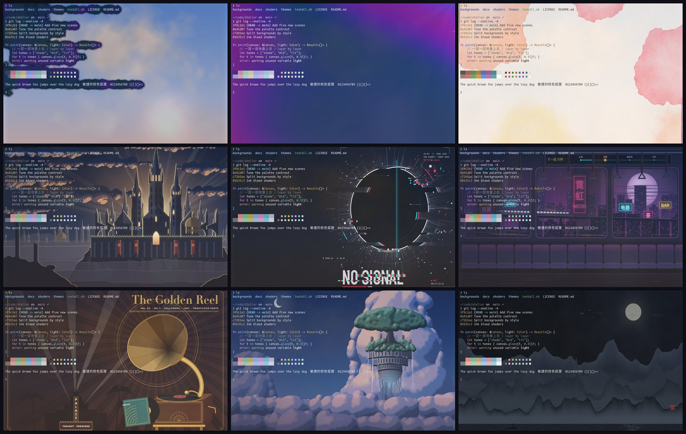

## 目录

- [安装](#安装)
- [全部主题一览](#全部主题一览)
- Shader 主题：[洇 · 水墨晕开](#ink) · [钻石玻璃](#diamond) · [蜡笔水彩](#crayon)
- 背景画主题：[静态画作](#paintings) · [三渲二](#toon) · [故障](#glitch) · [赛博](#cyber) · [复古](#retro) · [卡通](#cartoon)
- 透明主题：[透明玻璃](#glass) · [蕾丝](#lace)
- [说明](#说明)
- [仓库结构](#仓库结构)
- [许可证](#许可证)

## 安装

```sh
git clone https://github.com/youjzz-git/ghostty-atelier.git
cd ghostty-atelier
./install.sh
```

`install.sh` 把 `themes/`、`shaders/` 和 `backgrounds/` 拷进 `~/.config/ghostty/` 下的同名目录，不会改动你的配置文件。同名文件会被覆盖，更新时再跑一遍就行。

然后在 `~/.config/ghostty/config` 里选一个主题。背景画主题只需要两三行：

```ini
theme = toon-citadel
background-opacity = 0.8
background-opacity-cells = true
```

Shader 主题还要加上对应的 shader，透明主题要把 `background-opacity` 改成 0.5，每个系列下面都写了完整的配置。换到别的系列时，记得把上一套的 `custom-shader` 行删掉或注释掉，否则 shader 还会继续生效。

改完按 `⌘⇧,` 重载配置。如果背景图或 shader 没有变化，新开一个窗口就能看到。

## 全部主题一览

| # | 主题 | 系列 | 需要的 shader | 背景图 | 推荐透明度 |
|---|---|---|---|---|---|
| 1 | [`ink-ultramarine`](#ink) | 洇 · 水墨晕开 | `bleed-measure.glsl` + `bleed-spread.glsl` + `bleed.glsl` | — | 0.8 |
| 2 | [`diamond-opal`](#diamond) | 钻石玻璃 | `diamond.glsl` | — | 0.8 |
| 3 | [`diamond-ruby`](#diamond) | 钻石玻璃 | `diamond.glsl` | — | 0.8 |
| 4 | [`diamond-sapphire`](#diamond) | 钻石玻璃 | `diamond.glsl` | — | 0.8 |
| 5 | [`diamond-aqua`](#diamond) | 钻石玻璃 | `diamond.glsl` | — | 0.8 |
| 6 | [`diamond-amethyst`](#diamond) | 钻石玻璃 | `diamond.glsl` | — | 0.8 |
| 7 | [`diamond-garnet`](#diamond) | 钻石玻璃 | `diamond.glsl` | — | 0.8 |
| 8 | [`diamond-abyss`](#diamond) | 钻石玻璃 | `diamond.glsl` | — | 0.8 |
| 9 | [`diamond-tourmaline`](#diamond) | 钻石玻璃 | `diamond.glsl` | — | 0.8 |
| 10 | [`crayon-peach`](#crayon) | 蜡笔水彩 | `watercolor.glsl` | — | 0.85 |
| 11 | [`crayon-lemon`](#crayon) | 蜡笔水彩 | `watercolor.glsl` | — | 0.85 |
| 12 | [`crayon-lilac`](#crayon) | 蜡笔水彩 | `watercolor.glsl` | — | 0.85 |
| 13 | [`crayon-seaside`](#crayon) | 蜡笔水彩 | `watercolor.glsl` | — | 0.85 |
| 14 | [`crayon-starry`](#crayon) | 蜡笔水彩 | `watercolor.glsl` | — | 0.85 |
| 15 | [`crayon-cocoa`](#crayon) | 蜡笔水彩 | `watercolor.glsl` | — | 0.85 |
| 16 | [`crayon-moss`](#crayon) | 蜡笔水彩 | `watercolor.glsl` | — | 0.85 |
| 17 | [`crayon-berry`](#crayon) | 蜡笔水彩 | `watercolor.glsl` | — | 0.85 |
| 18 | [`paint-dusk`](#paintings) | 静态画作 | — | `dusk.jpg` | 0.97 |
| 19 | [`crayon-night`](#paintings) | 静态画作 | — | `crayon.jpg` | 0.97 |
| 20 | [`ink-moon`](#paintings) | 静态画作 | — | `ink.jpg` | 0.97 |
| 21 | [`impression-dawn`](#paintings) | 静态画作 | — | `impression.jpg` | 0.97 |
| 22 | [`scroll-qingming`](#paintings) | 静态画作 | — | `qingming.jpg` | 0.97 |
| 23 | [`toon-planet`](#toon) | 三渲二 | — | `toon.jpg` | 0.8 |
| 24 | [`toon-koi`](#toon) | 三渲二 | — | `koi.jpg` | 0.8 |
| 25 | [`toon-castle`](#toon) | 三渲二 | — | `castle.jpg` | 0.8 |
| 26 | [`toon-citadel`](#toon) | 三渲二 | — | `citadel.jpg` | 0.8 |
| 27 | [`toon-leyndell`](#toon) | 三渲二 | — | `leyndell.jpg` | 0.8 |
| 28 | [`glitch-signal`](#glitch) | 故障 | — | `glitch.jpg` | 0.8 |
| 29 | [`glitch-peony`](#glitch) | 故障 | — | `peony.jpg` | 0.8 |
| 30 | [`glitch-mirage`](#glitch) | 故障 | — | `mirage.jpg` | 0.8 |
| 31 | [`glitch-eclipse`](#glitch) | 故障 | — | `eclipse.jpg` | 0.8 |
| 32 | [`cyber-neon`](#cyber) | 赛博 | — | `cyber.jpg` | 0.8 |
| 33 | [`cyber-sakura`](#cyber) | 赛博 | — | `sakura.jpg` | 0.8 |
| 34 | [`cyber-skyrail`](#cyber) | 赛博 | — | `skyrail.jpg` | 0.8 |
| 35 | [`cyber-skycity`](#cyber) | 赛博 | — | `skycity.jpg` | 0.8 |
| 36 | [`retro-seventies`](#retro) | 复古 | — | `retro.jpg` | 0.8 |
| 37 | [`retro-flowerpower`](#retro) | 复古 | — | `flowerpower.jpg` | 0.8 |
| 38 | [`retro-steampunk`](#retro) | 复古 | — | `steampunk.jpg` | 0.8 |
| 39 | [`retro-gramophone`](#retro) | 复古 | — | `gramophone.jpg` | 0.8 |
| 40 | [`sticker-pop`](#cartoon) | 卡通 | — | `sticker.jpg` | 0.8 |
| 41 | [`sticker-garden`](#cartoon) | 卡通 | — | `garden.jpg` | 0.8 |
| 42 | [`cartoon-teahouse`](#cartoon) | 卡通 | — | `cafe.jpg` | 0.8 |
| 43 | [`cartoon-laputa`](#cartoon) | 卡通 | — | `laputa.jpg` | 0.8 |
| 44 | [`glass-moongate`](#glass) | 透明玻璃 | — | `glass-moongate.png` | 0.5 |
| 45 | [`glass-aurora`](#glass) | 透明玻璃 | — | `glass-aurora.png` | 0.5 |
| 46 | [`glass-rain`](#glass) | 透明玻璃 | — | `glass-rain.png` | 0.5 |
| 47 | [`lace-cameo`](#lace) | 蕾丝 | — | `lace-cameo.png` | 0.5 |
| 48 | [`lace-curtain`](#lace) | 蕾丝 | — | `lace-curtain.png` | 0.5 |
| 49 | [`lace-veil`](#lace) | 蕾丝 | — | `lace-veil.png` | 0.5 |

<a id="ink"></a>

## 洇 · 水墨晕开

窗口是一块透明玻璃，底色由文字自己晕出来：每段字底下化开一片墨，边缘有颜料颗粒和一圈干掉的水线，没有字的地方几乎完全透明。原理、性能数据和可调参数见 [docs/ink-bleed.md](docs/ink-bleed.md)。

```ini
theme = ink-ultramarine
background-opacity = 0.8
background-opacity-cells = true
window-padding-x = 12
custom-shader = ~/.config/ghostty/shaders/bleed-measure.glsl
custom-shader = ~/.config/ghostty/shaders/bleed-spread.glsl
custom-shader = ~/.config/ghostty/shaders/bleed.glsl
custom-shader-animation = false
```

<table>
<tr><td width="50%" valign="top"><a href="docs/previews/ink-ultramarine.jpg">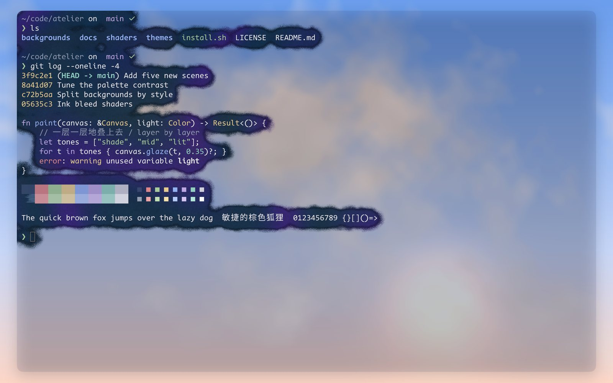</a><br><code>ink-ultramarine</code><br>偏紫的群青墨，珍珠白文字，其他 ANSI 颜色取矢车菊蓝、香槟金、叶绿、玫瑰红、淡紫和祖母绿。</td><td width="50%"></td></tr>
</table>

<a id="diamond"></a>

## 钻石玻璃

整扇窗口是一块有颜色的宝石玻璃。色相像欧泊一样在相邻几种颜色之间缓慢流动，亮度保持不变，所以文字对比度处处一样；右上角有一点分光，边缘内侧有几处固定的高光。前四个明亮，后四个是对应的深色版。

```ini
theme = diamond-opal
background-opacity = 0.8
background-opacity-cells = true
custom-shader = ~/.config/ghostty/shaders/diamond.glsl
custom-shader-animation = false
```

把 `theme` 换成下面任意一个名字即可，shader 不用变。

<table>
<tr><td width="50%" valign="top"><a href="docs/previews/diamond-opal.jpg">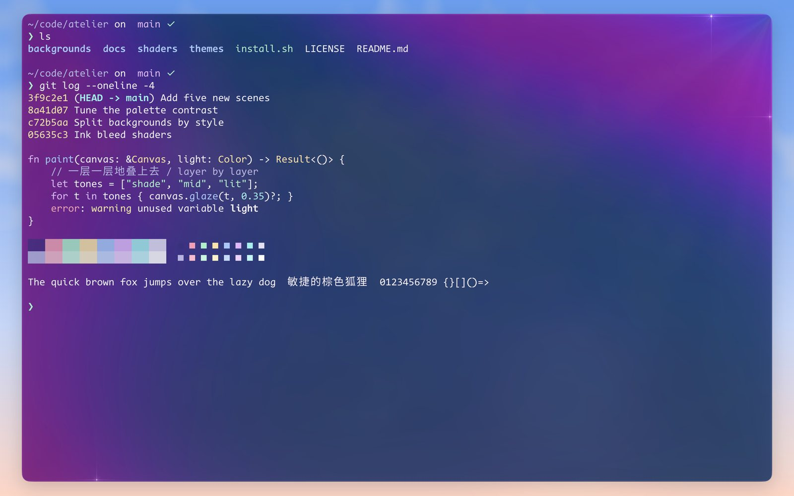</a><br><code>diamond-opal</code><br>蛋白石紫，往蓝宝石和玫瑰色流动。</td><td width="50%" valign="top"><a href="docs/previews/diamond-ruby.jpg">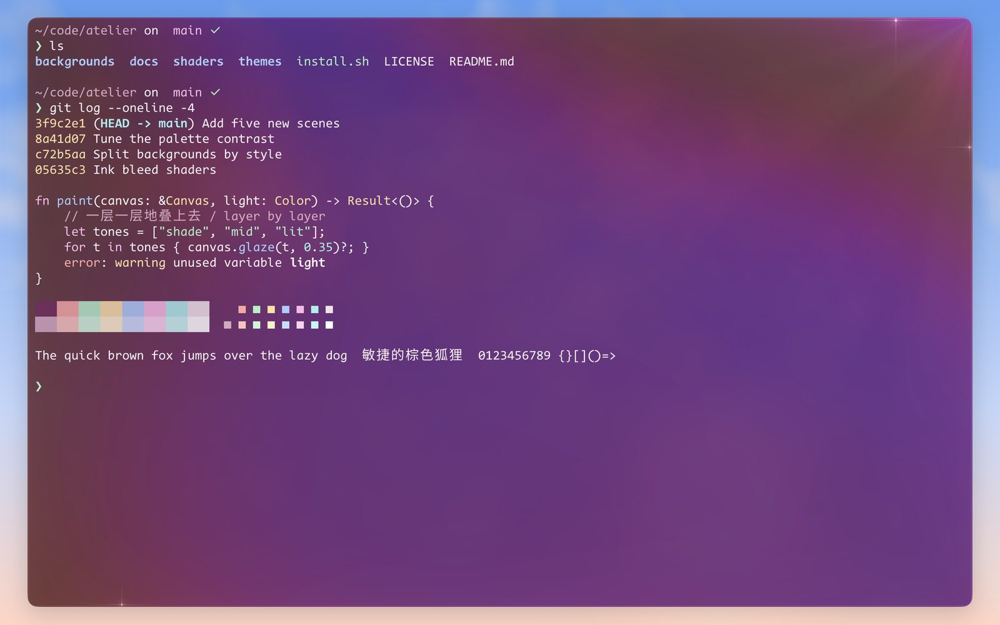</a><br><code>diamond-ruby</code><br>红宝石玫瑰色，往紫罗兰和深红流动。</td></tr>
<tr><td width="50%" valign="top"><a href="docs/previews/diamond-sapphire.jpg">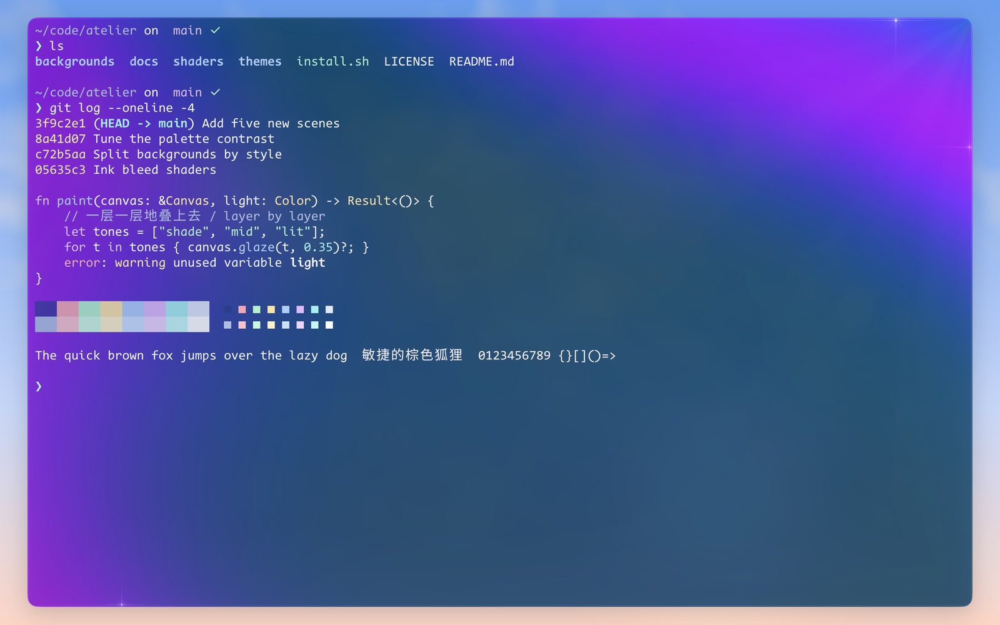</a><br><code>diamond-sapphire</code><br>宝蓝，往天青和靛蓝流动。</td><td width="50%" valign="top"><a href="docs/previews/diamond-aqua.jpg">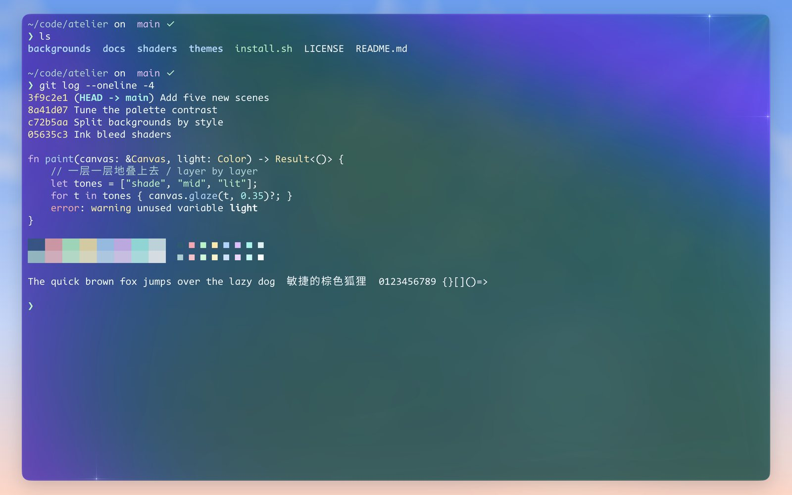</a><br><code>diamond-aqua</code><br>海玻璃青，往薄荷绿和蓝宝石流动。</td></tr>
<tr><td width="50%" valign="top"><a href="docs/previews/diamond-amethyst.jpg">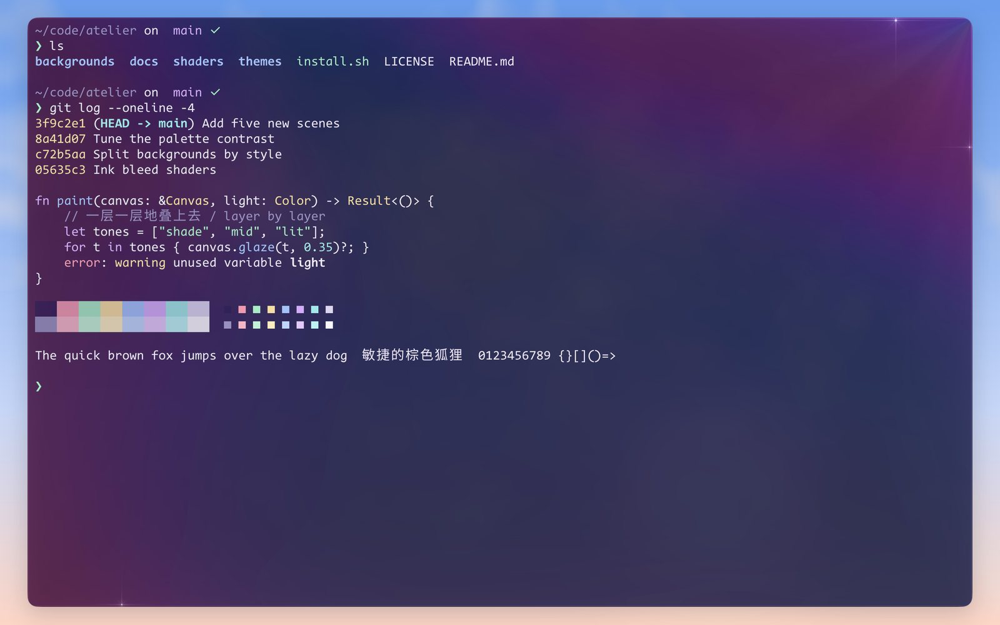</a><br><code>diamond-amethyst</code><br>深紫水晶，往靛蓝和梅子色流动。</td><td width="50%" valign="top"><a href="docs/previews/diamond-garnet.jpg">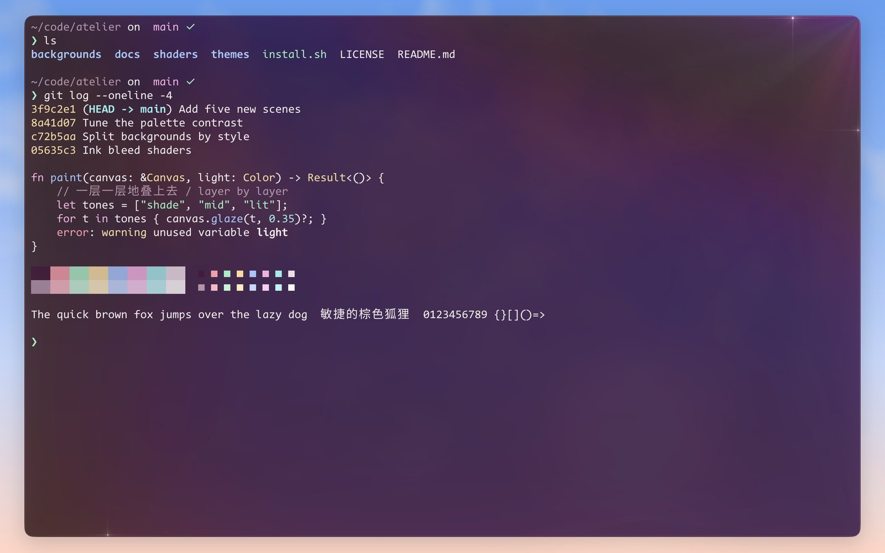</a><br><code>diamond-garnet</code><br>深酒红石榴石，Ruby 的深色版。</td></tr>
<tr><td width="50%" valign="top"><a href="docs/previews/diamond-abyss.jpg">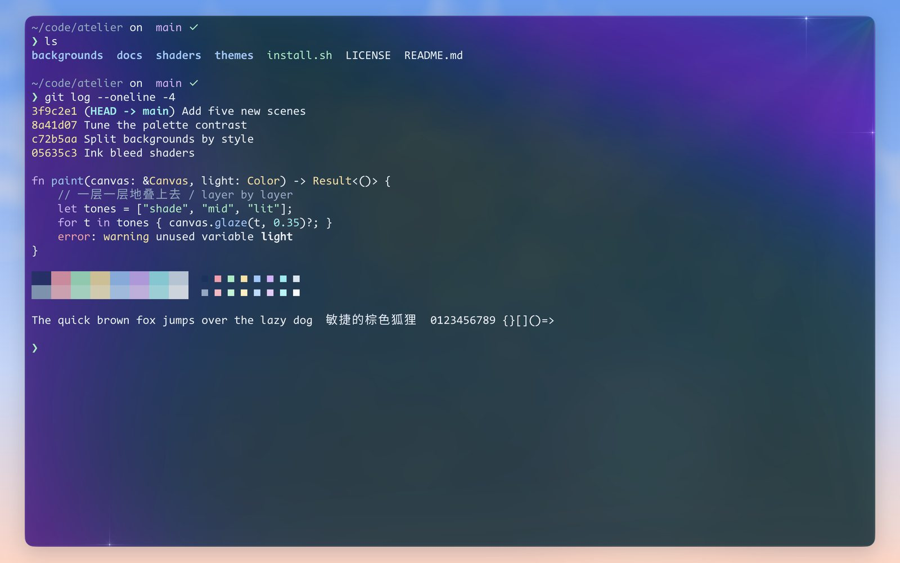</a><br><code>diamond-abyss</code><br>深海藏青，往海青和靛蓝流动。</td><td width="50%" valign="top"><a href="docs/previews/diamond-tourmaline.jpg">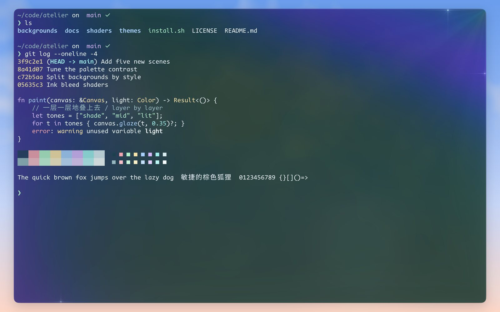</a><br><code>diamond-tourmaline</code><br>深青碧玺，Aqua 的深色版。</td></tr>
</table>

<a id="crayon"></a>

## 蜡笔水彩

终端背景变成一张水彩纸。几片水彩从窗口边缘铺进来，颜料用的是主题自己的光标色、选区色和亮黄，干的时候在边缘积成一圈，沉进纸纹里；两道蜡笔线沿着对角画在边距里。中间留给文字。前四个是浅色纸，后四个是深色卡纸，颜料像粉彩一样浮在上面。

```ini
theme = crayon-peach
background-opacity = 0.85
background-opacity-cells = true
custom-shader = ~/.config/ghostty/shaders/watercolor.glsl
custom-shader-animation = false
```

把 `theme` 换成下面任意一个名字即可，shader 不用变。

<table>
<tr><td width="50%" valign="top"><a href="docs/previews/crayon-peach.jpg">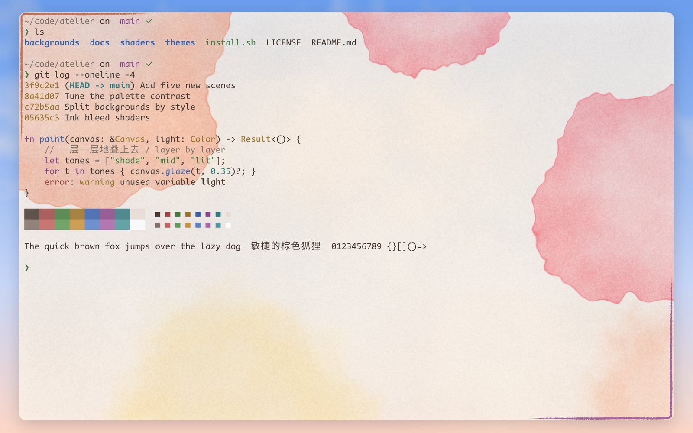</a><br><code>crayon-peach</code><br>奶油色纸，桃色和玫瑰色水彩，珊瑚色蜡笔。</td><td width="50%" valign="top"><a href="docs/previews/crayon-lemon.jpg">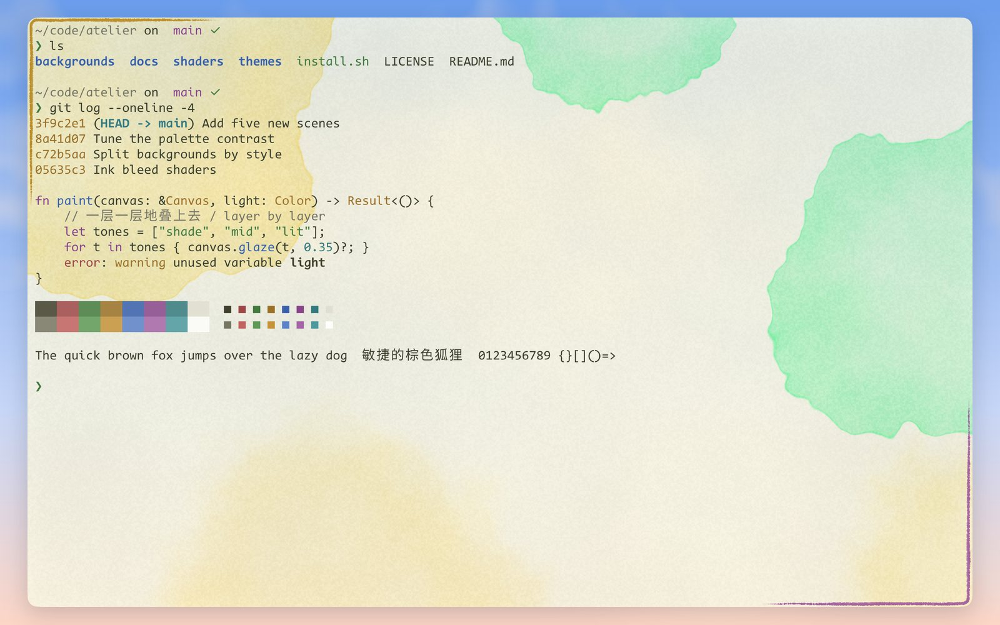</a><br><code>crayon-lemon</code><br>黄油色纸，柠檬和薄荷水彩，万寿菊色蜡笔。</td></tr>
<tr><td width="50%" valign="top"><a href="docs/previews/crayon-lilac.jpg">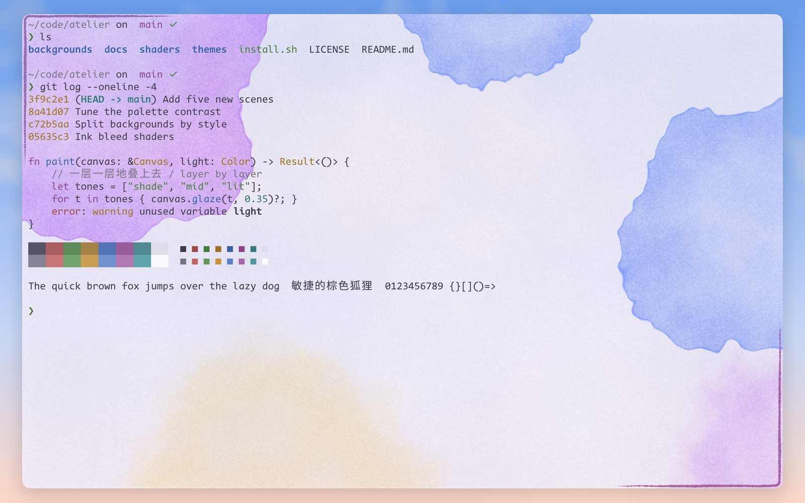</a><br><code>crayon-lilac</code><br>薰衣草色纸，丁香紫和长春花蓝水彩。</td><td width="50%" valign="top"><a href="docs/previews/crayon-seaside.jpg">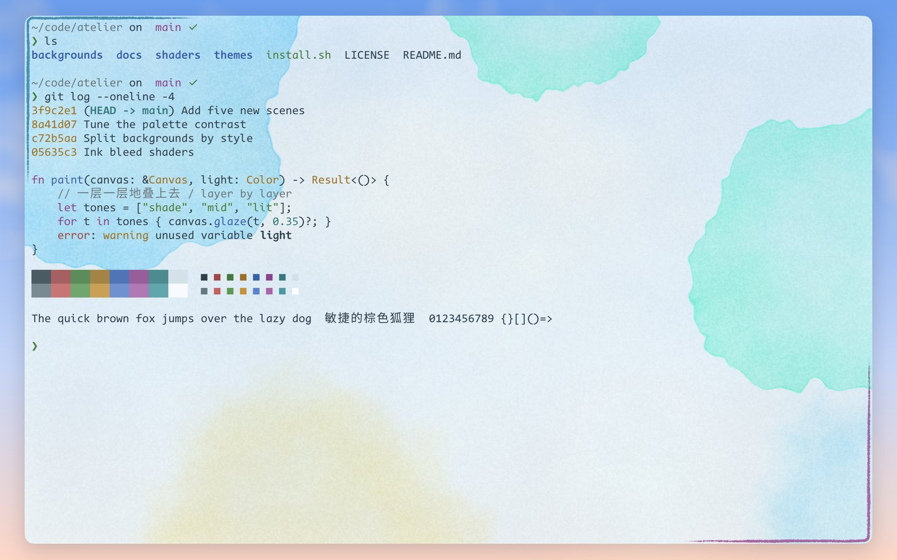</a><br><code>crayon-seaside</code><br>海盐白纸，天蓝和水绿水彩。</td></tr>
<tr><td width="50%" valign="top"><a href="docs/previews/crayon-starry.jpg">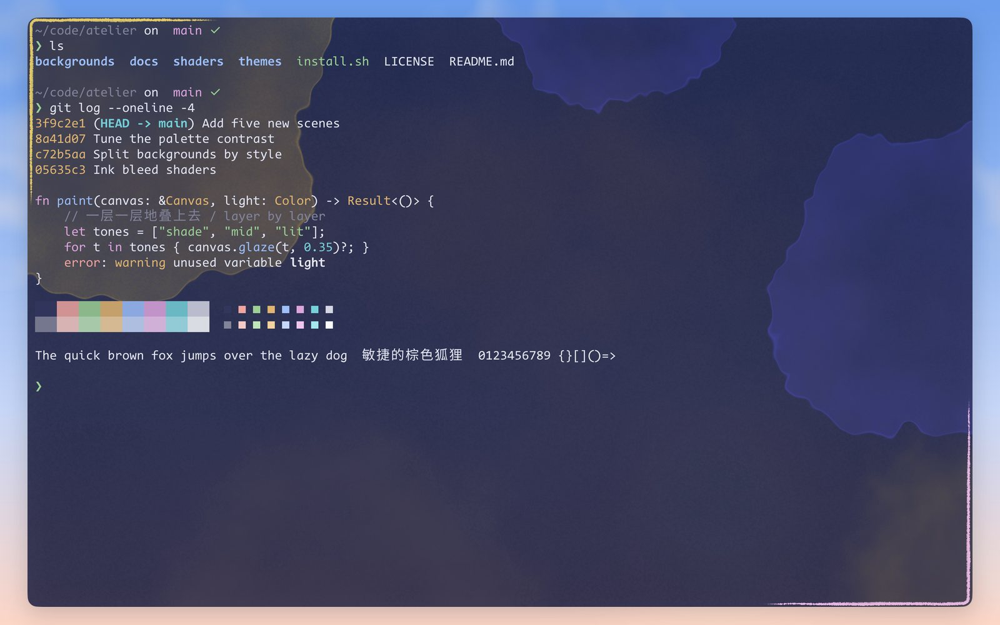</a><br><code>crayon-starry</code><br>靛蓝夜色卡纸，柠檬黄的星星蜡笔，蓝色晕染。</td><td width="50%" valign="top"><a href="docs/previews/crayon-cocoa.jpg">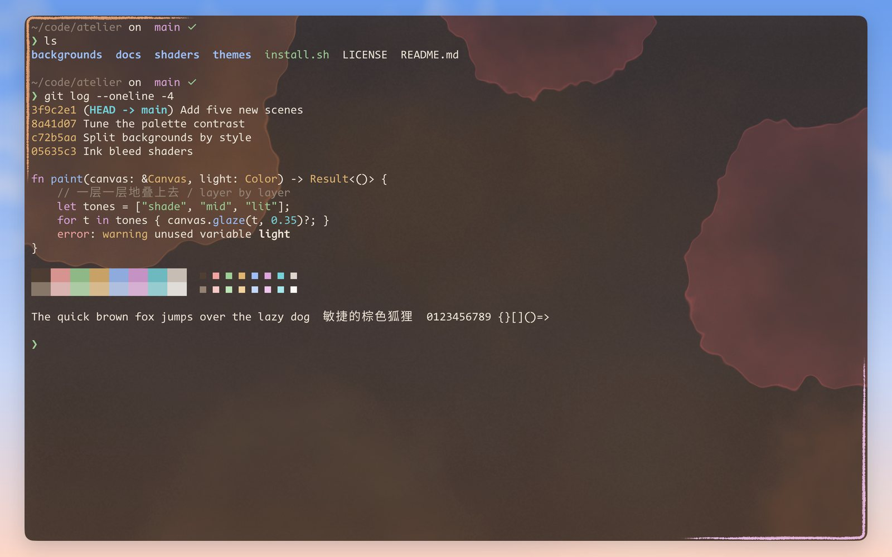</a><br><code>crayon-cocoa</code><br>暖色牛皮纸，杏色和玫瑰色粉彩。</td></tr>
<tr><td width="50%" valign="top"><a href="docs/previews/crayon-moss.jpg">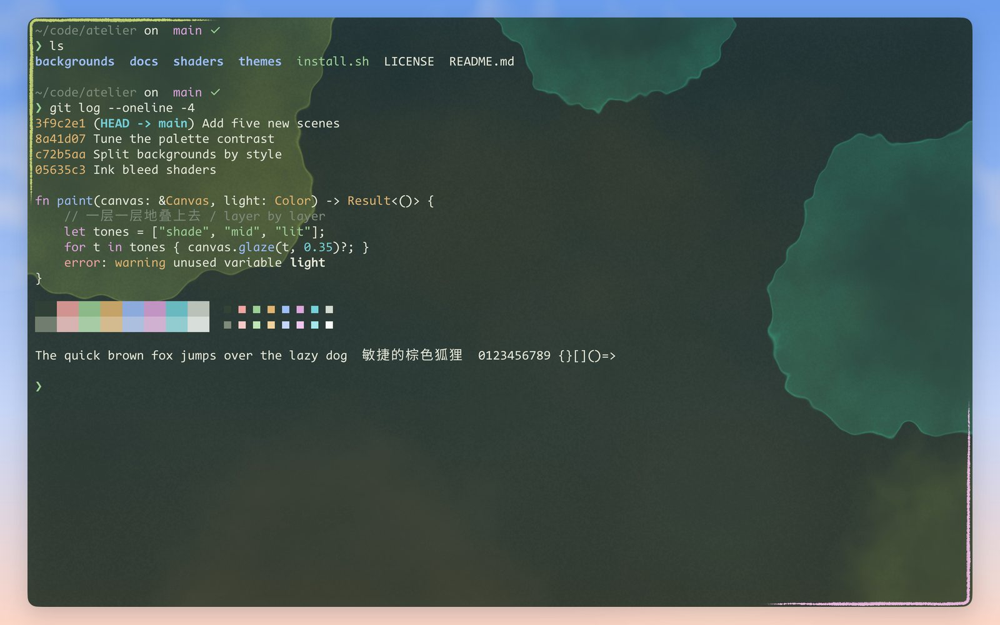</a><br><code>crayon-moss</code><br>深苔绿卡纸，青柠和鼠尾草色粉彩。</td><td width="50%" valign="top"><a href="docs/previews/crayon-berry.jpg">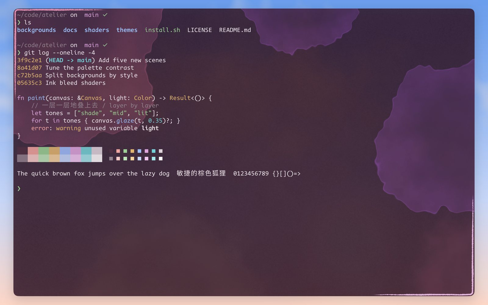</a><br><code>crayon-berry</code><br>梅子色卡纸，粉色和丁香紫粉彩。</td></tr>
</table>

<a id="paintings"></a>

## 静态画作

四幅完整的画作放在终端背后。画面细节多，透明度太低时会被壁纸搅浑，所以推荐 0.95 以上。

```ini
theme = paint-dusk
background-opacity = 0.97
background-opacity-cells = true
```

<table>
<tr><td width="50%" valign="top"><a href="docs/previews/paint-dusk.jpg">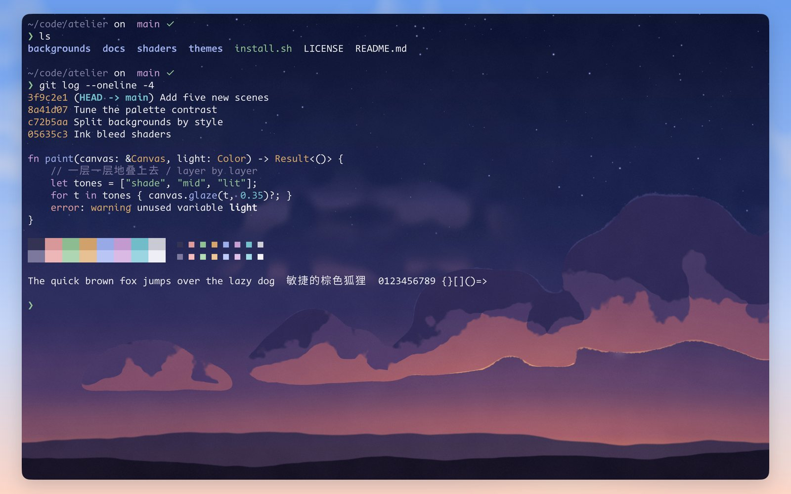</a><br><code>paint-dusk</code><br>板绘 · 黄昏云海：动画背景画法的蓝调天空，云底被最后一点夕阳照亮，底部一道暗色山脊。</td><td width="50%" valign="top"><a href="docs/previews/crayon-night.jpg">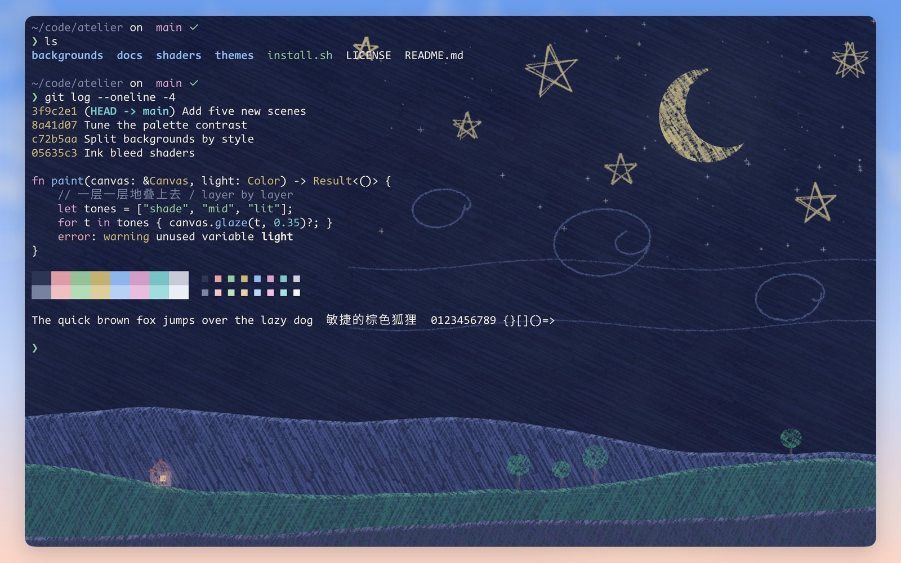</a><br><code>crayon-night</code><br>蜡笔 · 星夜：深蓝卡纸上的蜡笔画，月亮、星星、旋转的夜空、排线的山丘、几棵棒棒糖树和一扇亮灯的窗。</td></tr>
<tr><td width="50%" valign="top"><a href="docs/previews/ink-moon.jpg">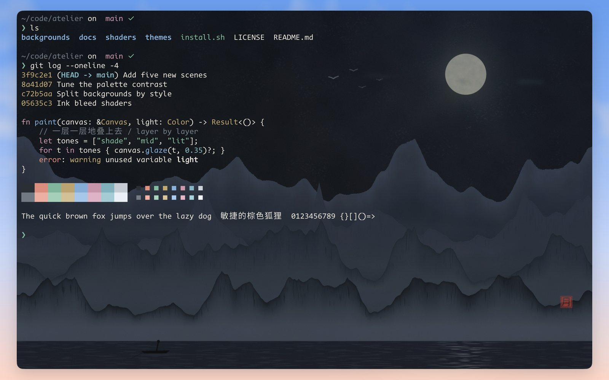</a><br><code>ink-moon</code><br>水墨 · 远山：反转成暗色的水墨山水，远山层层隐进雾里，一轮月、几只鸟、一叶小舟和一方朱印。</td><td width="50%" valign="top"><a href="docs/previews/impression-dawn.jpg">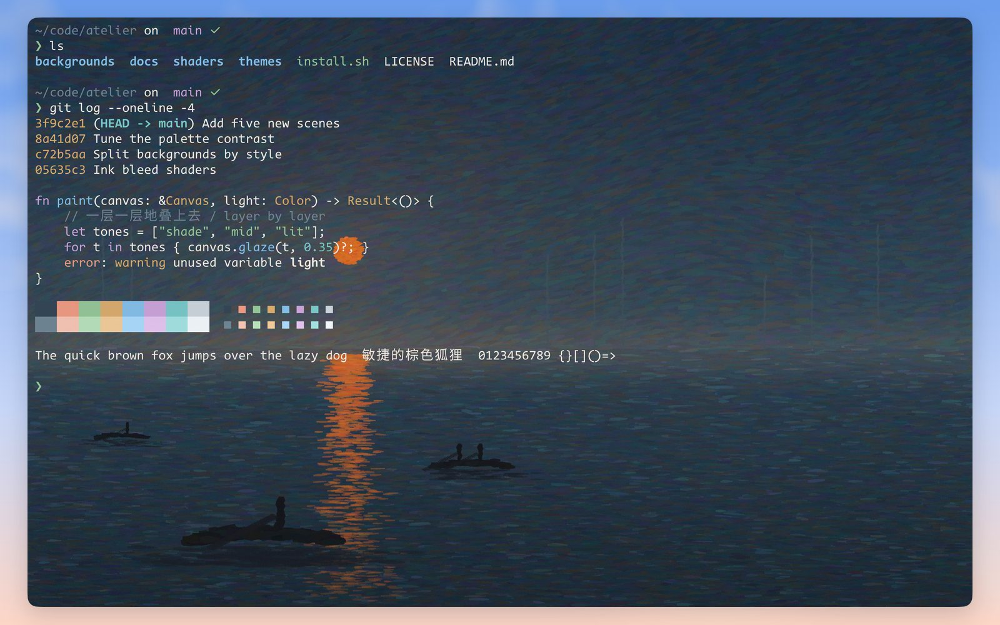</a><br><code>impression-dawn</code><br>印象 · 日出：仿莫奈笔触的清晨港口，灰蓝雾气里一轮橙色太阳和它的倒影，几条小船。</td></tr>
<tr><td width="50%" valign="top"><a href="docs/previews/scroll-qingming.jpg">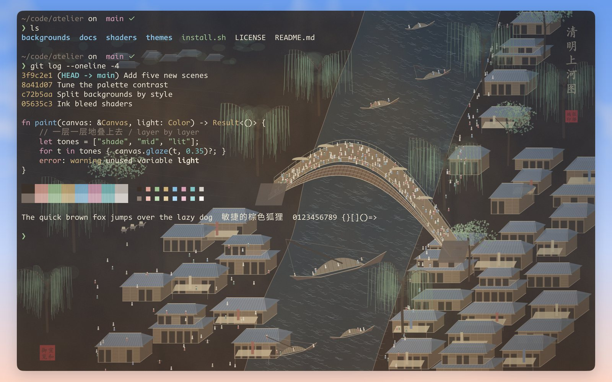</a><br><code>scroll-qingming</code><br>长卷 · 清明上河图：在深色旧绢上用浅墨重画虹桥一段，桥上挤满了人，大船在桥下落桅，两岸是店铺、楼阁和柳树。</td><td width="50%"></td></tr>
</table>

<a id="toon"></a>

## 三渲二

像动画赛璐璐那样上色：每块形体只有平涂的暗面、亮面和一道硬边光。

```ini
theme = toon-planet
background-opacity = 0.8
background-opacity-cells = true
```

<table>
<tr><td width="50%" valign="top"><a href="docs/previews/toon-planet.jpg">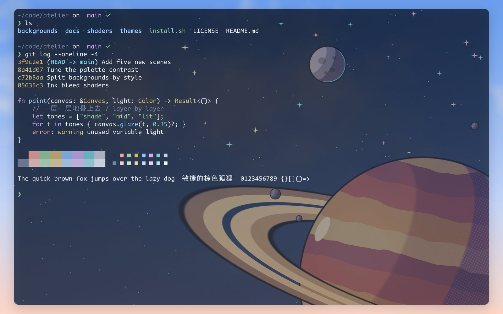</a><br><code>toon-planet</code><br>带环的行星和卫星，硬边光带、青色边缘光、阴影里的漫画网点、粗描边。</td><td width="50%" valign="top"><a href="docs/previews/toon-koi.jpg">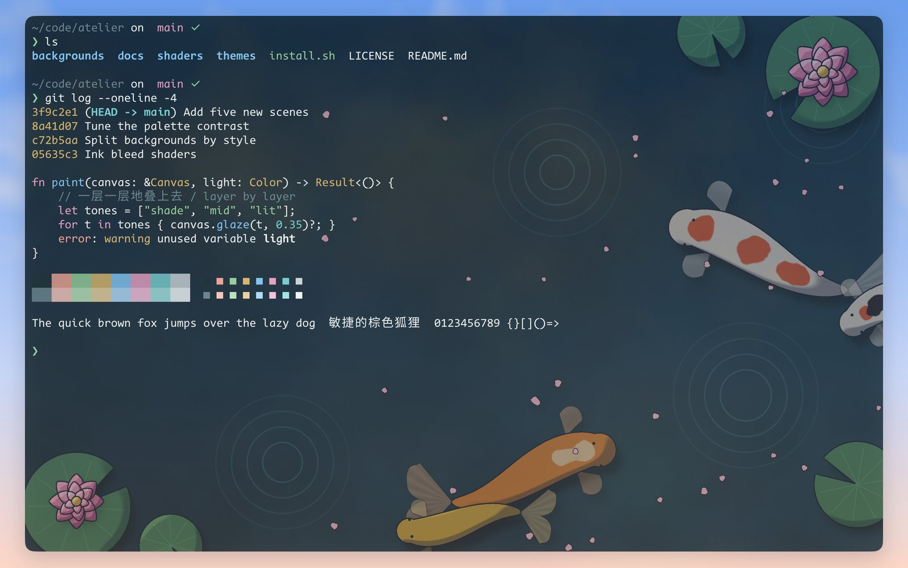</a><br><code>toon-koi</code><br>俯视的夜间池塘，锦鲤、睡莲叶和莲花，影子落在池底，水纹和飘落的花瓣。</td></tr>
<tr><td width="50%" valign="top"><a href="docs/previews/toon-castle.jpg">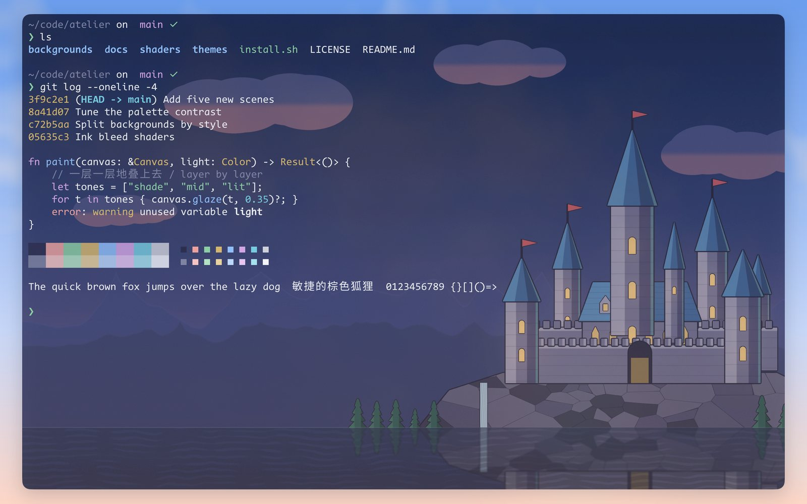</a><br><code>toon-castle</code><br>黄昏时湖心岩岛上的城堡，圆塔尖顶、陡峭屋顶、暖色窗灯，湖面倒映着一切。</td><td width="50%" valign="top"><a href="docs/previews/toon-citadel.jpg">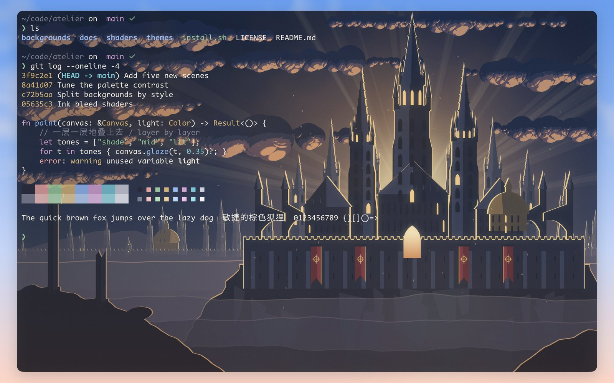</a><br><code>toon-citadel</code><br>峭壁高墙上的哥特王城，落日藏在主塔背后：平涂明暗、金色硬边光、光束、赛璐璐云层、深渊里的雾。</td></tr>
<tr><td width="50%" valign="top"><a href="docs/previews/toon-leyndell.jpg">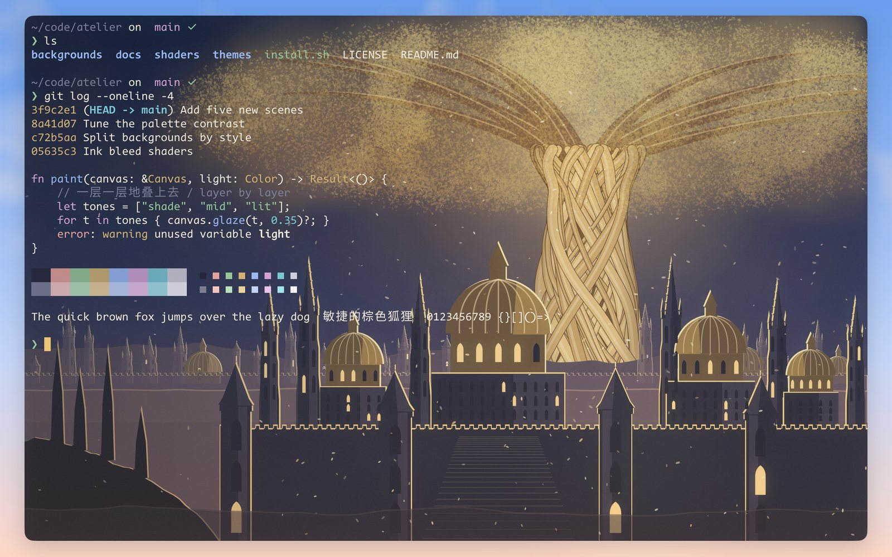</a><br><code>toon-leyndell</code><br>黄昏的王城，金顶圣殿和高墙之上立着一棵巨大的黄金树：树干由很多股绞成，发光的树冠铺满天空，金叶不停飘落。</td><td width="50%"></td></tr>
</table>

<a id="glitch"></a>

## 故障

定格的数字故障。画面都放在右侧和下方，左边留给文字。

```ini
theme = glitch-signal
background-opacity = 0.8
background-opacity-cells = true
```

<table>
<tr><td width="50%" valign="top"><a href="docs/previews/glitch-signal.jpg">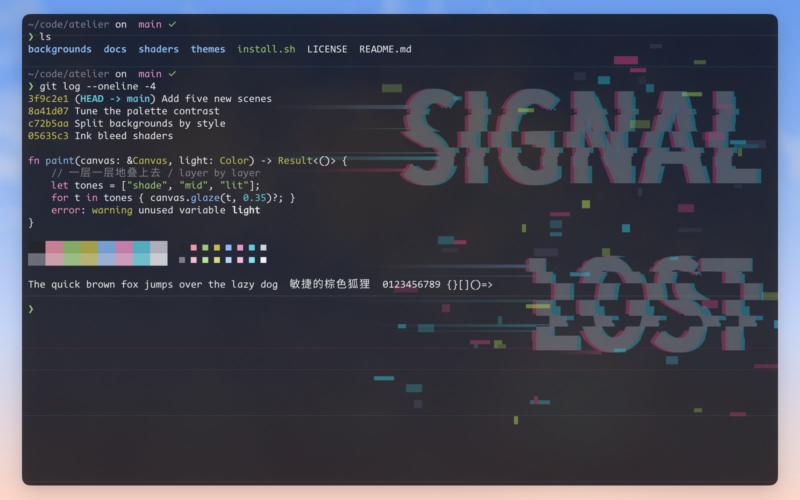</a><br><code>glitch-signal</code><br>撕裂的文字、分离的色彩通道、像素排序拖影、压缩色块和扫描线。</td><td width="50%" valign="top"><a href="docs/previews/glitch-peony.jpg">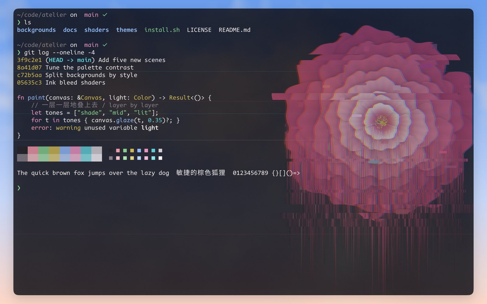</a><br><code>glitch-peony</code><br>一朵被损坏的牡丹：像素排序的滴落、横向错位的切片、错开的色彩通道。</td></tr>
<tr><td width="50%" valign="top"><a href="docs/previews/glitch-mirage.jpg">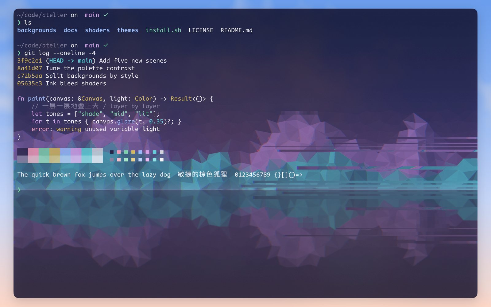</a><br><code>glitch-mirage</code><br>蒸汽波配色的低多边形山峦和静水，整行排成光带，马赛克块，少量色差。</td><td width="50%" valign="top"><a href="docs/previews/glitch-eclipse.jpg">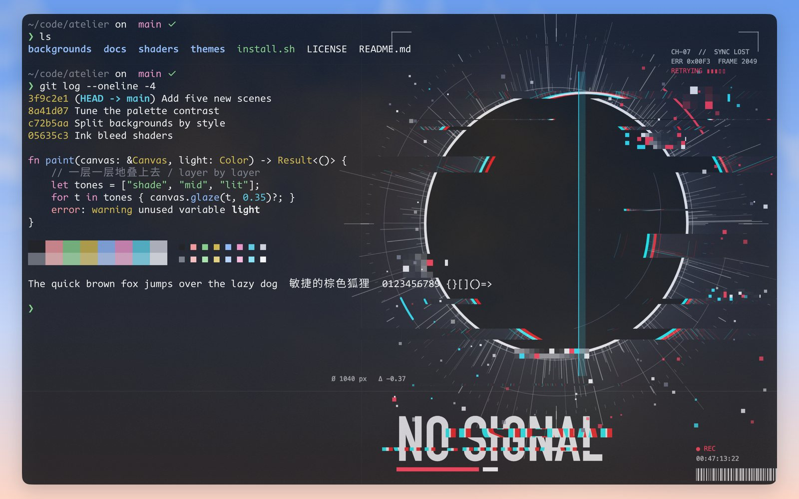</a><br><code>glitch-eclipse</code><br>边缘锐利的黑日和白热日冕，被切成几片横向错开，只用红青两色错位，配像素块和 HUD 小字，没有任何模糊。</td></tr>
</table>

<a id="cyber"></a>

## 赛博

霓虹、雨夜和城市。

```ini
theme = cyber-neon
background-opacity = 0.8
background-opacity-cells = true
```

<table>
<tr><td width="50%" valign="top"><a href="docs/previews/cyber-neon.jpg">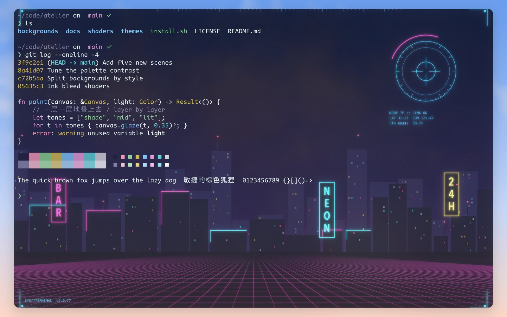</a><br><code>cyber-neon</code><br>夜间天际线，霓虹描边和竖排招牌，透视网格地面，四角的 HUD 框和准星。</td><td width="50%" valign="top"><a href="docs/previews/cyber-sakura.jpg">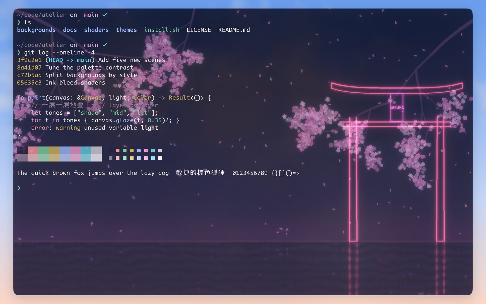</a><br><code>cyber-sakura</code><br>雨夜里霓虹勾勒的鸟居、发光的樱花枝和飘落的花瓣，湿地面倒映着灯光。</td></tr>
<tr><td width="50%" valign="top"><a href="docs/previews/cyber-skyrail.jpg">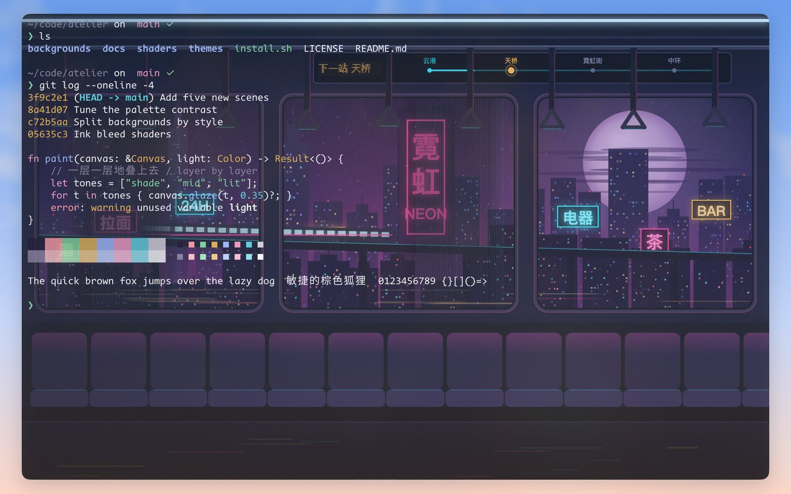</a><br><code>cyber-skyrail</code><br>坐在夜间空轨车厢里看对面的车窗：窗外是下雨的霓虹城和低垂的月亮，另一条线的列车驶过，头顶有线路屏和吊环。</td><td width="50%" valign="top"><a href="docs/previews/cyber-skycity.jpg">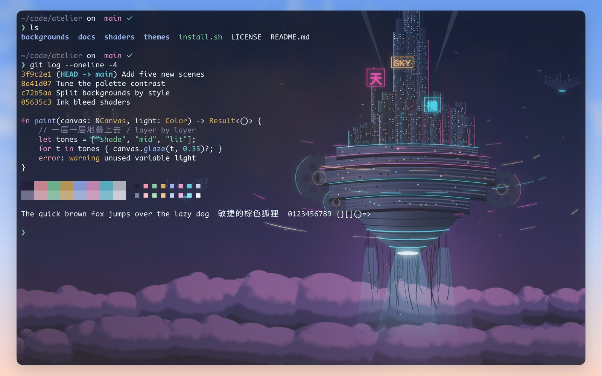</a><br><code>cyber-skycity</code><br>悬在夜空里的机械城：顶上挤满高楼，中间几层甲板布满管道和齿轮，底下的引擎往云海里打光束，四周是流光车道。</td></tr>
</table>

<a id="retro"></a>

## 复古

旧印刷品的质感：有限的几种油墨、网点、纸张颗粒和一点套色错位。

```ini
theme = retro-seventies
background-opacity = 0.8
background-opacity-cells = true
```

<table>
<tr><td width="50%" valign="top"><a href="docs/previews/retro-seventies.jpg">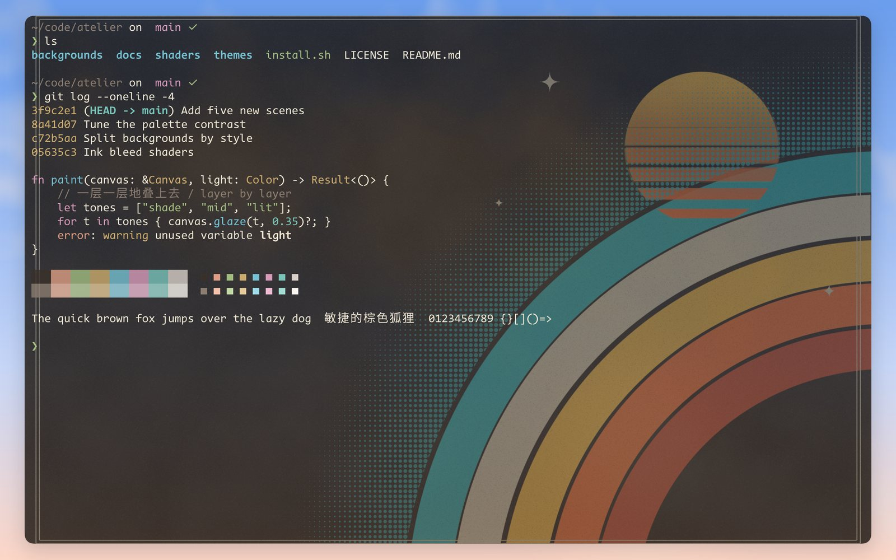</a><br><code>retro-seventies</code><br>七十年代海报：拱形条纹、切片太阳、星光和网点，印在深棕色纸上。</td><td width="50%" valign="top"><a href="docs/previews/retro-flowerpower.jpg">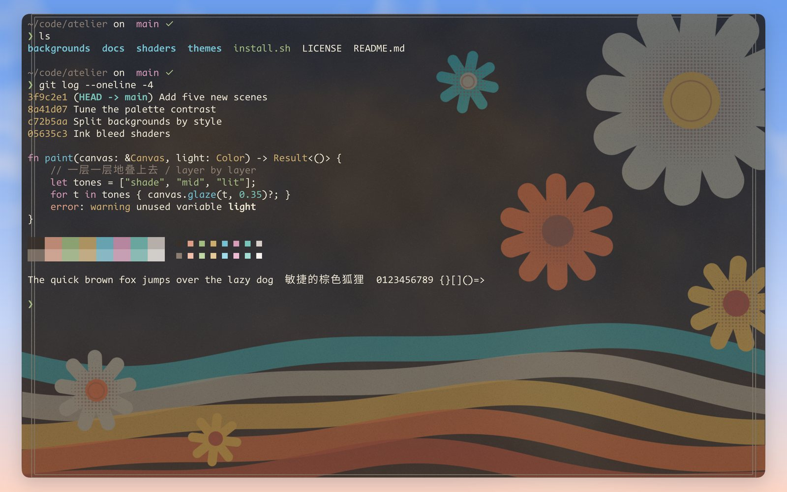</a><br><code>retro-flowerpower</code><br>七十年代印花：圆瓣大雏菊和波浪条纹。</td></tr>
<tr><td width="50%" valign="top"><a href="docs/previews/retro-steampunk.jpg">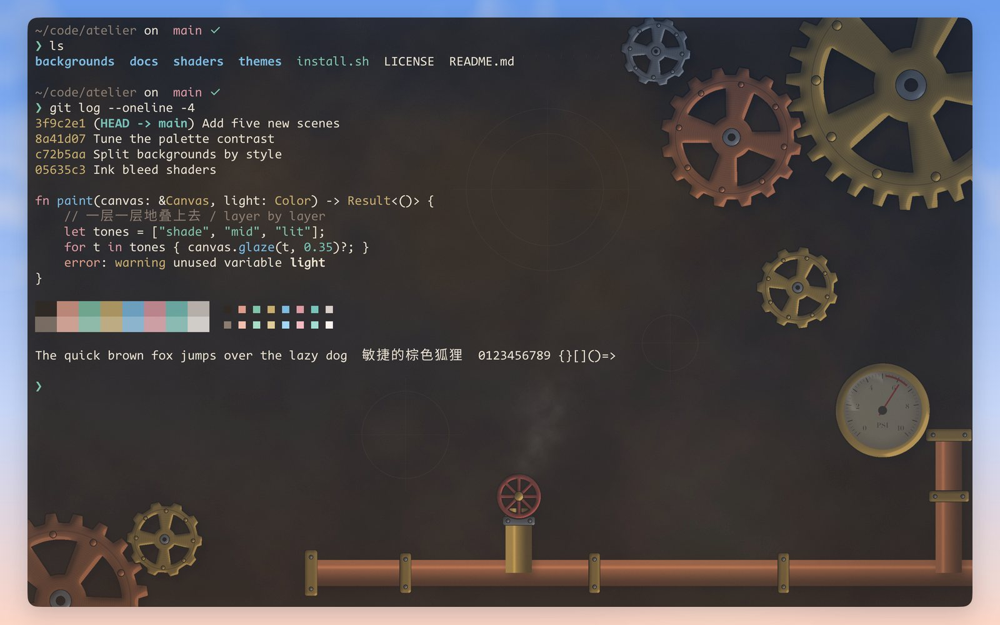</a><br><code>retro-steampunk</code><br>深褐底上的黄铜和紫铜机械：咬合的齿轮、压力表、带法兰的铜管和阀门轮、一缕蒸汽、淡淡的工程图。</td><td width="50%" valign="top"><a href="docs/previews/retro-gramophone.jpg">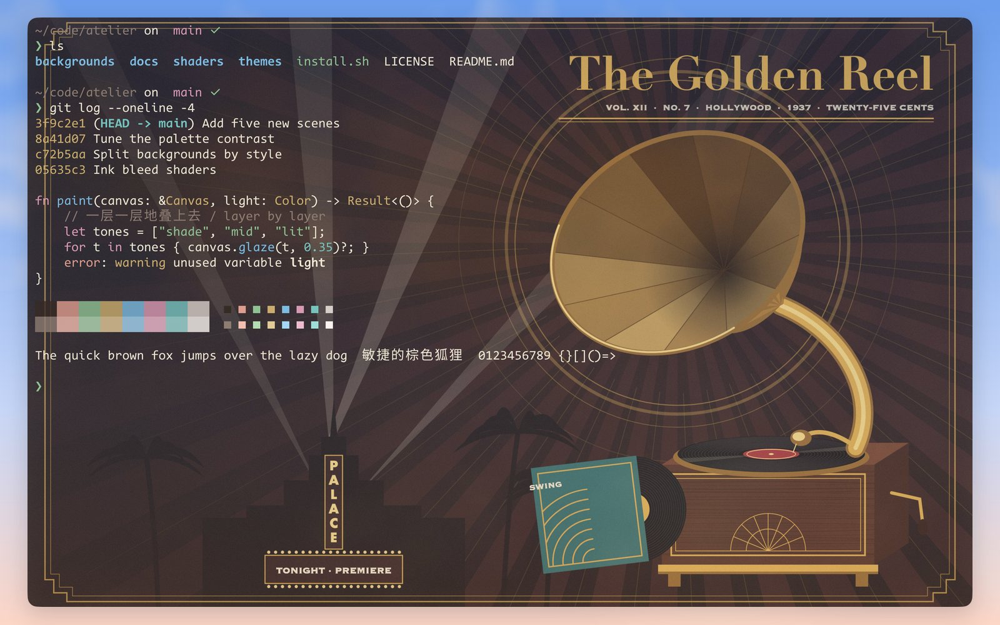</a><br><code>retro-gramophone</code><br>装饰艺术风的 1930 年代好莱坞杂志封面：放射背景、影院首映的探照灯、黄铜喇叭留声机、金色报头和阶梯边框。</td></tr>
</table>

<a id="cartoon"></a>

## 卡通

轻松可爱的一组。

```ini
theme = sticker-pop
background-opacity = 0.8
background-opacity-cells = true
```

<table>
<tr><td width="50%" valign="top"><a href="docs/previews/sticker-pop.jpg">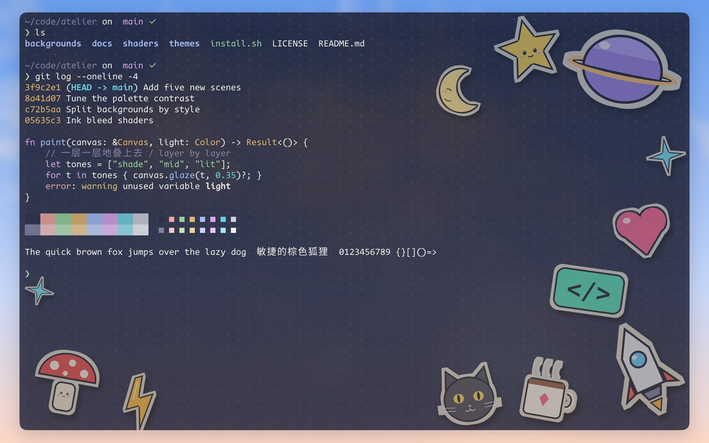</a><br><code>sticker-pop</code><br>深色波点底，四角和右侧贴满模切白边的卡通贴纸。</td><td width="50%" valign="top"><a href="docs/previews/sticker-garden.jpg">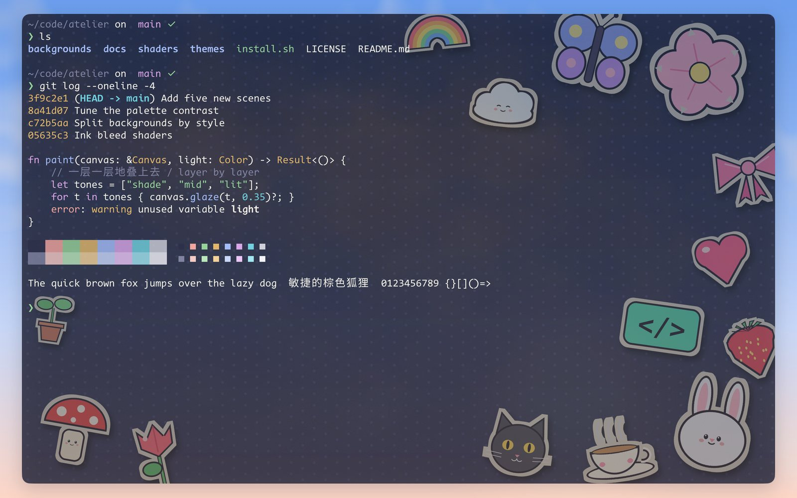</a><br><code>sticker-garden</code><br>同样的波点底，贴的是花园主题的贴纸。</td></tr>
<tr><td width="50%" valign="top"><a href="docs/previews/cartoon-teahouse.jpg">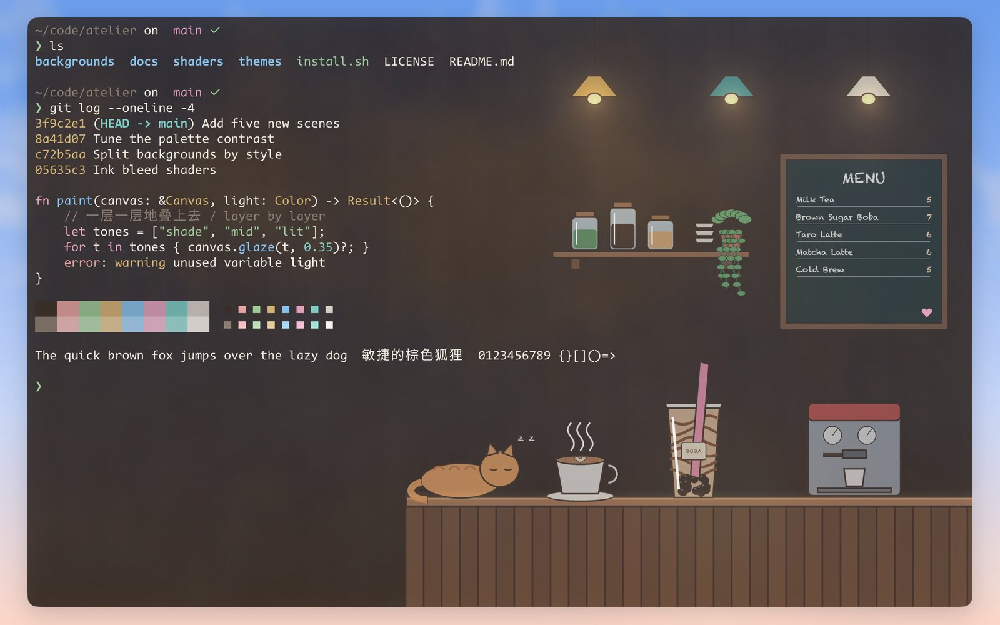</a><br><code>cartoon-teahouse</code><br>夜里的奶茶店：吊灯、黑板菜单、摆着罐子和绿植的架子，柜台上有珍珠奶茶、拿铁、咖啡机和一只睡着的猫。</td><td width="50%" valign="top"><a href="docs/previews/cartoon-laputa.jpg">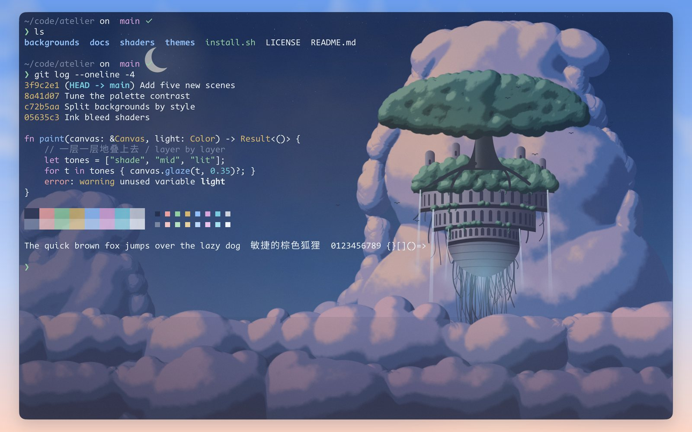</a><br><code>cartoon-laputa</code><br>蓝调时刻，吉卜力背景画的感觉：积雨云还留着最后一点光，前面浮着长着大树的空中之城，瀑布和根须垂下来，下面是云海。</td></tr>
</table>

<a id="glass"></a>

## 透明玻璃

图是带透明通道的 PNG：一部分画成实的，其余留作玻璃，桌面壁纸从玻璃那部分透出来，成了画的一部分。主题文件里带了 `background-image-opacity = 1.9`，把实心的部分补回不透明；`background-opacity` 要在你自己的 config 里改成 0.5，因为 config 里的值会覆盖主题里的。

```ini
theme = glass-moongate
background-opacity = 0.5
background-opacity-cells = true
```

<table>
<tr><td width="50%" valign="top"><a href="docs/previews/glass-moongate.jpg">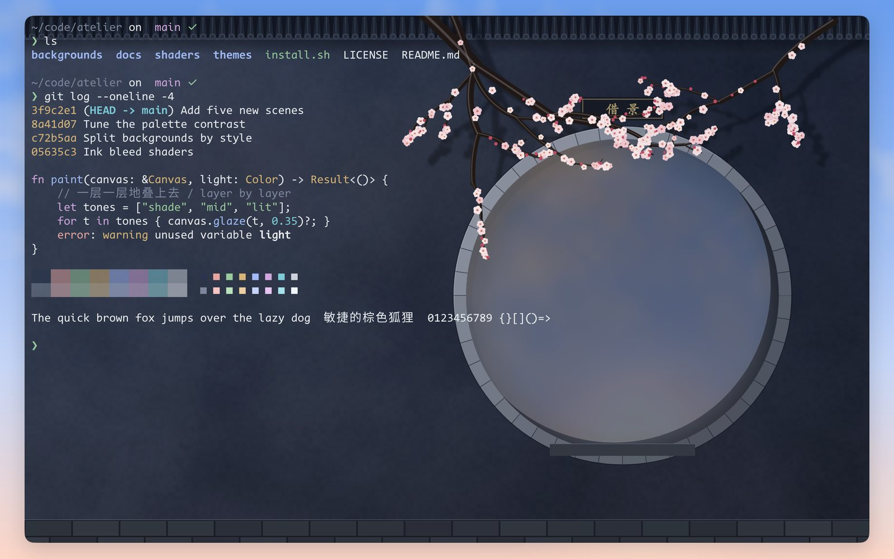</a><br><code>glass-moongate</code><br>借景 · 月洞门：夜里的园林粉墙开一扇圆门，一枝梅从墙头伸过来。墙是实的，圆门里看到的是你的桌面。</td><td width="50%" valign="top"><a href="docs/previews/glass-aurora.jpg">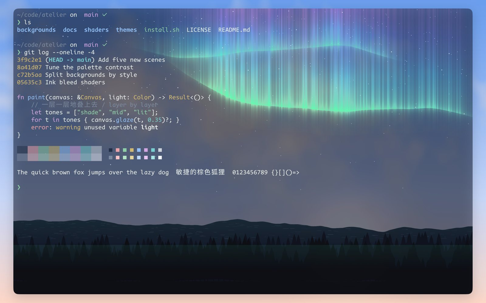</a><br><code>glass-aurora</code><br>极光：一整幅极光光帘挂在玻璃上，几颗星，底部是实心的云杉山林，终端最下面几行正好落在深色上。</td></tr>
<tr><td width="50%" valign="top"><a href="docs/previews/glass-rain.jpg">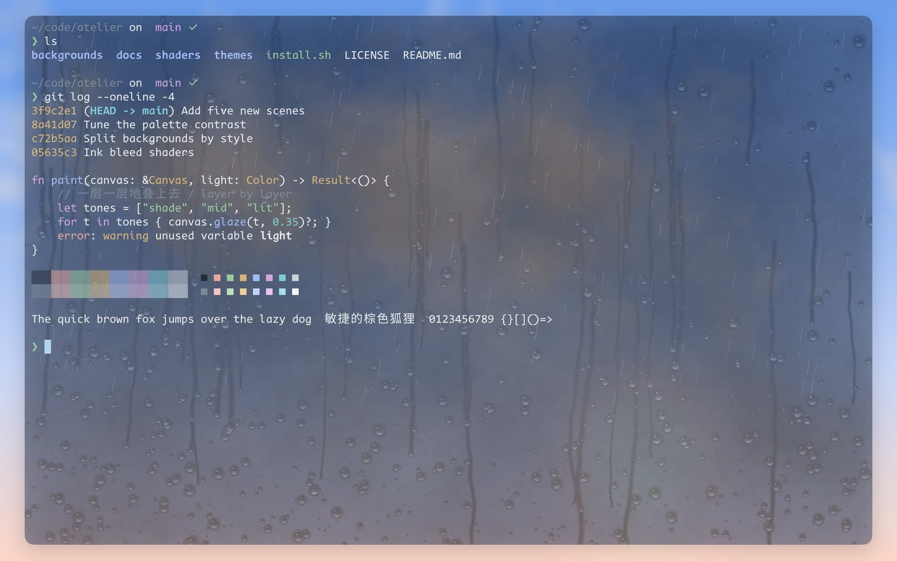</a><br><code>glass-rain</code><br>雨窗：雨夜的窗玻璃上满是雾气，雨滴和往下流的水痕把雾擦开，桌面从擦开的地方透出来。</td><td width="50%"></td></tr>
</table>

<a id="lace"></a>

## 蕾丝

深色蕾丝铺在玻璃上。线都是深色的，字落在上面照样清楚；网孔会透出一点桌面，右上方各留一个开口，桌面在那里露得最多。开口的位置按全屏窗口设计，适合把壁纸里的人物或主体框在里面。用法和透明玻璃一样：`background-opacity` 设成 0.5。

```ini
theme = lace-cameo
background-opacity = 0.5
background-opacity-cells = true
```

<table>
<tr><td width="50%" valign="top"><a href="docs/previews/lace-cameo.jpg">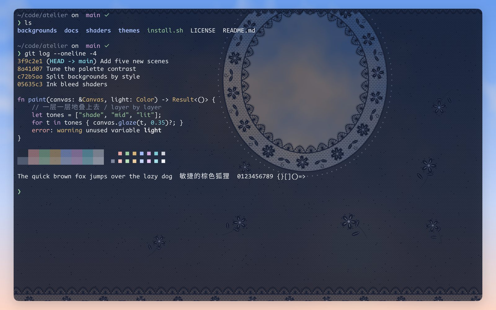</a><br><code>lace-cameo</code><br>浮雕框：午夜蓝网纱铺满整块玻璃，右上开一个椭圆浮雕框，框边是一圈镂空的香缇蕾丝，上下各有一道花边。</td><td width="50%" valign="top"><a href="docs/previews/lace-curtain.jpg">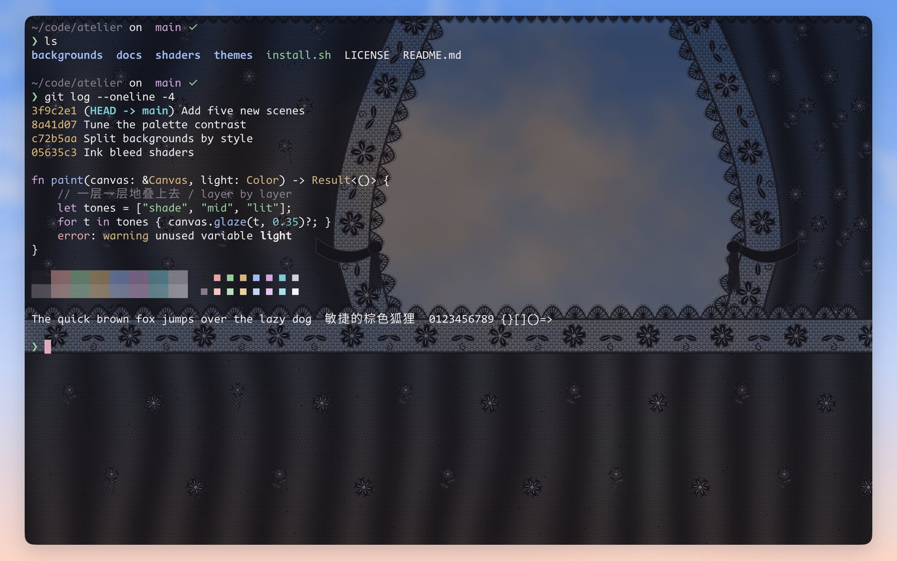</a><br><code>lace-curtain</code><br>窗纱：两片黑蕾丝窗帘用绑带束向两边，下半截是一道半帘，只在右上方留出一扇窗。</td></tr>
<tr><td width="50%" valign="top"><a href="docs/previews/lace-veil.jpg">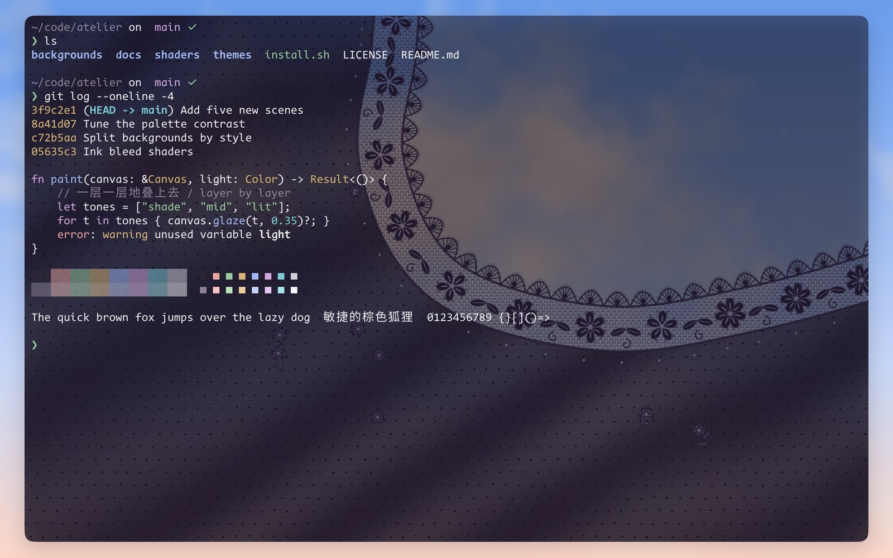</a><br><code>lace-veil</code><br>头纱：深紫色点纱头纱从左上垂下来，在右上方被撩开，边缘是一圈宽蕾丝。</td><td width="50%"></td></tr>
</table>

## 说明

预览图都是真实的 Ghostty 窗口截图，透明度按各系列推荐的值设置，窗口后面垫的是一张程序生成的天空图。实际用的时候透出来的是你自己的桌面壁纸，透明主题尤其如此：玻璃和开口里显示什么，取决于你的壁纸。

背景画主题靠 Ghostty 的 `background-image`，需要 1.2 或更新的版本。图片按 `cover` 方式铺满窗口并居中，窗口比例不同时两边会被裁掉一些。画面的主体大多放在右侧和下方，左上角尽量留给文字。

加载了任何 custom shader 之后，Ghostty 1.3.1 会在窗口处于前台时按屏幕刷新率持续重绘，所以 shader 主题比背景画主题更费 GPU。具体数字可以看 [洇的性能测试](docs/ink-bleed.md#性能)。

目前只在 macOS 上的 Ghostty 1.3.1 测试过。shader 按 Retina 屏写死了每点两个像素，在 1 倍屏上纹理会显得粗一倍，功能不受影响。

## 仓库结构

```
themes/        主题文件，49 个
shaders/       bleed-measure / bleed-spread / bleed（洇）、diamond（钻石玻璃）、watercolor（蜡笔水彩）
backgrounds/   背景画主题和透明主题用到的图片，3024×1964；透明主题的是带透明通道的 PNG
docs/          预览图、封面，以及洇的详细说明
install.sh     安装脚本
```

## 许可证

MIT。代码、主题和背景图都适用。
