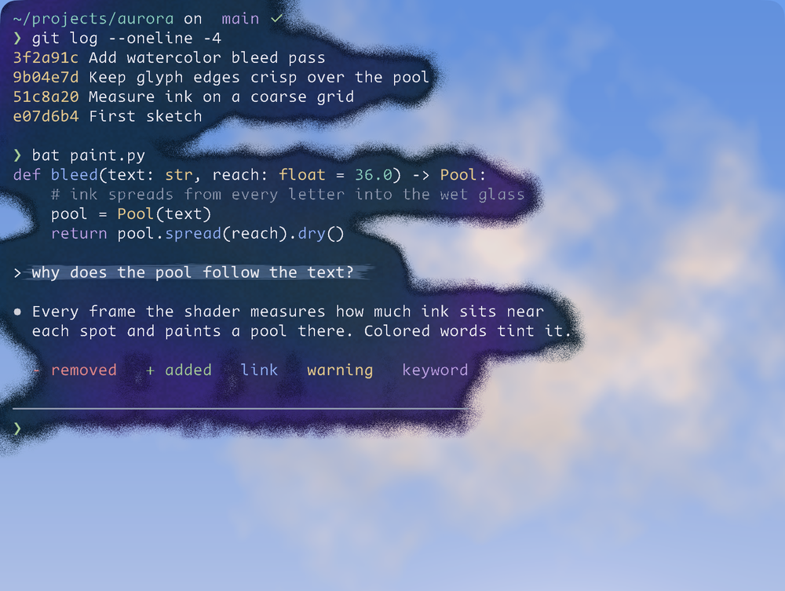
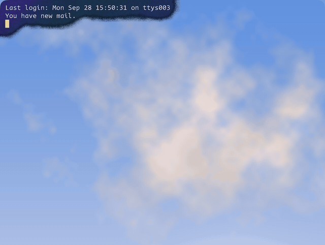

# 洇 · 水墨晕开

[English](ink-bleed.en.md) · [返回总览](../README.md)

「洇」是墨落在湿纸上慢慢渗开的样子。

这是一套给 [Ghostty](https://ghostty.org) 用的 shader。终端窗口不再铺一整块底色，而是一块透明的玻璃，底色由文字自己晕出来：每一段字底下化开一片墨，形状跟着文字走，边缘有颜料沉淀的颗粒和一圈干掉的水线，彩色的字会把自己的颜色往墨里带一点。没有字的地方几乎完全透明，桌面壁纸原样露出来。所以屏幕上每一刻的构图都不一样，打字、滚屏的时候，墨也跟着字走。





预览里窗口后面是一张程序生成的天空图，换成你自己的壁纸效果更好。

## 安装

先按[总览里的安装步骤](../README.md#安装)把文件装好，或者只拷这一套：

```sh
mkdir -p ~/.config/ghostty/shaders ~/.config/ghostty/themes
cp shaders/bleed-measure.glsl shaders/bleed-spread.glsl shaders/bleed.glsl ~/.config/ghostty/shaders/
cp themes/ink-ultramarine ~/.config/ghostty/themes/
```

然后在 `~/.config/ghostty/config` 里加上：

```ini
theme = ink-ultramarine
background-opacity = 0.8
window-padding-x = 12

# 三个 shader 缺一不可，顺序也不能换
custom-shader = ~/.config/ghostty/shaders/bleed-measure.glsl
custom-shader = ~/.config/ghostty/shaders/bleed-spread.glsl
custom-shader = ~/.config/ghostty/shaders/bleed.glsl
custom-shader-animation = false
```

保存后按 `⌘⇧,` 重载配置。如果只改了 shader 文件的内容，重载后没有变化，新开一个窗口就能看到。

`background-opacity` 必须小于 1。shader 靠透明度区分“字”和“背景”：背景像素的 alpha 等于这个值，字形像素是完全不透明的。设成 1 的话什么都认不出来。

## 它是怎么工作的

要知道“这里附近有没有字”，最直接的办法是让每个像素在自己周围一圈采样。第一版就是这么写的，每个像素采 96 个点，效果很好，但太费 GPU。问题出在 Ghostty 这边：1.3.1 版只要加载了 custom shader，窗口在前台时就会按屏幕刷新率一直重绘，ProMotion 屏上就是每秒 120 帧，`custom-shader-animation = false` 也关不掉。所以 shader 每一帧的开销都要乘以 120。

现在的做法是拆成三遍。先把窗口划成边长十几个像素的粗格子：

1. `bleed-measure.glsl` 统计每个格子里有多少“墨”（字形，或者和背景颜色不同的格子），以及这些墨的平均颜色。
2. `bleed-spread.glsl` 在格子之间做一次高斯模糊，得到墨晕开之后每个格子的浓度。
3. `bleed.glsl` 让每个像素从周围四个格子插值出浓度，决定这里是墨还是玻璃，然后上色。

格子的数据总得有地方放。Ghostty 的几个 shader 之间只传一张和窗口一样大的图，没有别的缓冲区可用。好在窗口左右两侧的 padding 里永远不会画字，所以前两遍把格子数据写进窗口左右最外侧各 12 个像素里，第三遍画完再把这两条恢复成背景色。这些像素挨在一起，GPU 可以成批处理，前两遍真正干活的只占全屏像素的百分之一左右。这也是为什么 `window-padding-x` 不能小于 12。

上色的部分：主题的背景色就是墨色。墨在相邻的几个色相之间缓慢交替，亮度保持不变，所以不会影响文字的对比度。墨里叠了纸纹颗粒，靠近边缘的地方有一圈更深的水线，墨池边缘本身有一点随机起伏。附近的字如果是彩色的，墨会往那个颜色偏一点，比如蓝色链接底下偏蓝，黄色警告底下偏暖。字形本身、带背景色的格子、选区和图片都原样保留，不会被改动。

## 性能

测试环境是 M2 Max，Ghostty 1.3.1，测试窗口 1488×1864 像素并保持在前台，数值是 Ghostty 进程占用 GPU 时间的比例，从 IOKit 里每个进程的 `accumulatedGPUTime` 算出来。“转圈”模拟的是命令行工具每秒刷新十次的加载动画，“满屏刷新”是不停地往终端里输出彩色文字。

| 配置 | 转圈 | 满屏刷新 |
|---|---|---|
| 不加 shader | 约 1% | 约 11% |
| 只加一个什么都不做的 shader | 约 10% | — |
| 初版：每个像素采样 96 个点 | 约 57% | 约 60% |
| 现在的三遍版本 | 约 25–30% | 约 27–30% |

第二行说明 Ghostty 的持续重绘本身就有固定开销，这部分和 shader 写得怎样无关。窗口越大、屏幕上的字越多，开销越高，全屏窗口大概是上表的两倍。笔记本用电池的时候可以留意一下。

## 可调参数

参数都写在 shader 文件开头的常量里，改完新开一个窗口生效。

| 常量 | 所在文件 | 默认值 | 作用 |
|---|---|---|---|
| `REACH` | bleed-spread | 36.0 | 墨能晕出文字多远，单位是点 |
| `INK_OPACITY` | bleed | 0.88 | 墨池里的不透明度 |
| `GLASS_OPACITY` | bleed | 0.10 | 没有字的地方的不透明度，设成 0 就完全透明 |
| `EDGE_LINE` | bleed | 1.0 | 墨池边缘那圈深色水线的强度 |
| `WORD_COLOR` | bleed | 1.0 | 墨从彩色文字那里借颜色的程度 |
| `HUE_DRIFT` | bleed | 0.06 | 墨在相邻色相之间交替的幅度，单位是圈 |
| `BRUSH` | bleed | 1.0 | 把 palette 8 的高亮底色画成一笔淡墨，设成 0 就保留原样 |
| `STRIP` | 三个文件 | 12 | 用来存数据的边缘宽度，单位是像素，三个文件要一致 |
| `DEVICE_SCALE` | bleed-spread、bleed | 2.0 | 每个点对应几个像素，Retina 屏是 2 |

## 换一种墨色

墨色就是主题的 `background`。`themes/ink-ultramarine` 是一种偏紫的群青，配珍珠白的文字，其他 ANSI 颜色取了矢车菊蓝、香槟金、叶绿、玫瑰红、淡紫和祖母绿，都调得比较柔和，在深色墨上够亮，又不刺眼。

换成别的主题也可以用，只要背景是深色，`background-opacity` 小于 1。背景色换成墨黑、赭石或者深绿，就是另一种墨。

## 配合 Claude Code

Claude Code 的 `dark-ansi` 主题会用 ANSI 的 bright black（也就是 palette 8）给用户自己发的消息铺一层灰底。`BRUSH` 打开时，`bleed.glsl` 会认出这种底色，把灰块重新画成一笔比周围稍亮的淡墨，带横向的笔刷纹理，两头和上下边缘是干笔飞白。其他程序里用 palette 8 做背景色的地方也会得到同样的处理。

识别时有个细节：Ghostty 画带背景色的格子时，会先铺窗口背景，再叠上格子的颜色，两层都用 `background-opacity`，所以画出来的颜色是 palette 8 混了大约六分之一的背景色，alpha 大约是 0.95。shader 里是按这个实际颜色来匹配的。

## 限制

目前只在 macOS 上的 Ghostty 1.3.1 测试过，Linux 没有试。

墨迹检测把所有和背景色不同的像素都当成“字”，所以带大块背景色的界面，比如 htop 的色条、vim 的状态栏，也会被墨包住。这通常看起来没问题，但它们的色块本身不会变成墨。

`DEVICE_SCALE` 按 Retina 屏设成 2。在非 Retina 的外接显示器上，纸纹和晕染范围会显得大一倍，功能不受影响。数据存储条只占 12 个像素，1 倍屏上 12pt 的 padding 刚好放得下。

分屏时，每个分屏各自算各自的墨。
